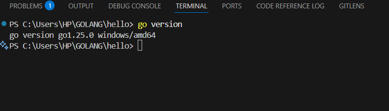
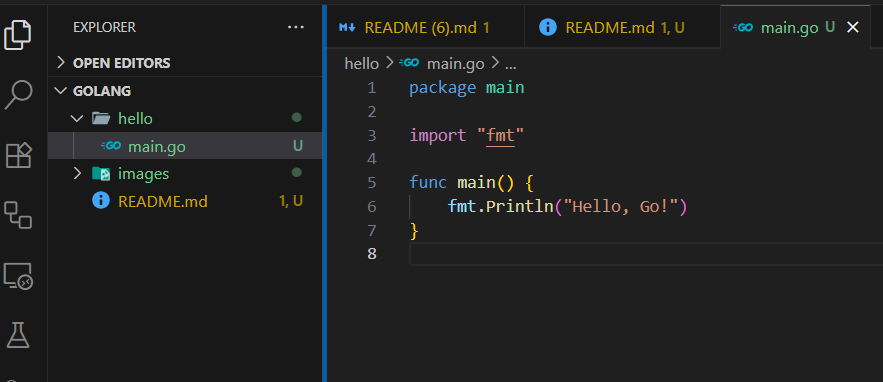
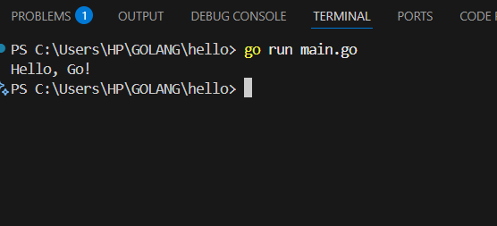
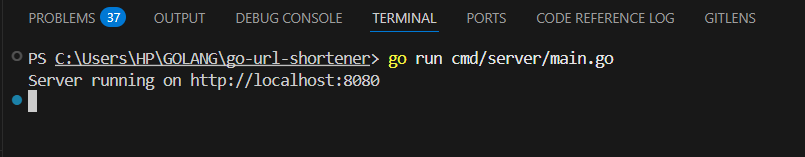
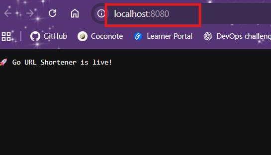
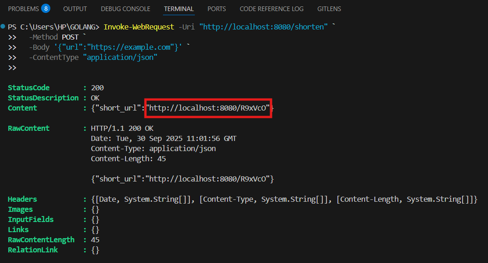
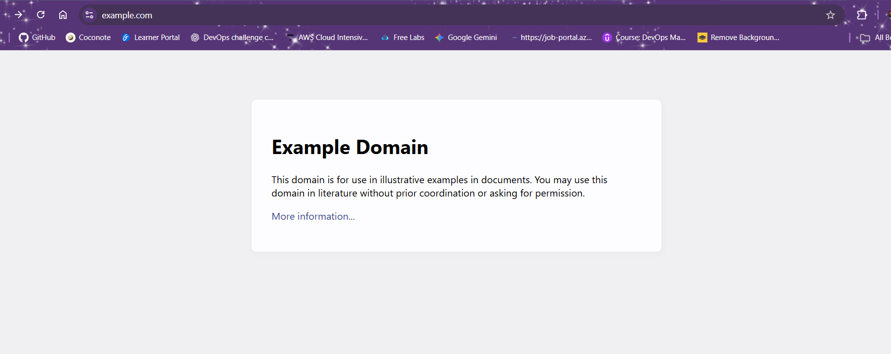
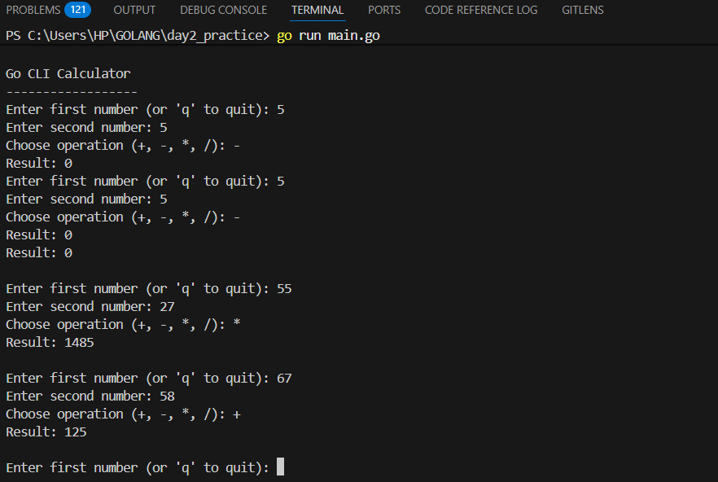

# Go Learning Journey

Welcome to my Go (Golang) learning repository! 🚀  
This repo documents my journey of learning Go, starting from installation to writing my first program.

---

## 📥 Installation

### Windows

1. Download Go from the [official site](https://go.dev/dl/)


- Run the installer. By default, Go will be installed in:

   ```pwsh
   C:\Program Files\Go
   ```

- Ensure Go is added to your PATH:
   1. Open **Command Prompt** or **PowerShell**
   2. Run:

     ```bash
     go version
      ```
- If it prints the `version`, Go is ready to use!



### Linux / Mac

```bash
wget https://go.dev/dl/go1.23.0.linux-amd64.tar.gz
sudo tar -C /usr/local -xzf go1.23.0.linux-amd64.tar.gz
export PATH=$PATH:/usr/local/go/bin
go version
```

---

## 📝 First Program

- Create a new folder for your project, for example `hello`.

- Inside, make a file called `main.go`:

```go
package main

import "fmt"

func main() {
    fmt.Println("Hello, Go!")
}
```



Run the program:

```bash
go run main.go
```

Output:

```bash
Hello, Go!
```



[LinkedIn: My First Go Lesson](https://www.linkedin.com/pulse/my-first-go-lesson-rashida-mohammed-ff5ie)

---

## GO Lesson 2: Variables and Data Types

Understanding variables and data types is one of the first steps toward writing meaningful code. Variables let us store data; data types tell Go what kind of data we’re working with.

---

### What are Variables?

Variables are containers for values. In Go, when you define a variable, you also decide (or let Go infer) what kind of data it will hold.

- You can declare variables explicitly using `var`.
- Or use shorthand `:=` to both declare and initialize.

---

### Common Data Types

Here are a few built-in types Go uses often:

| Data Type | Description          | Example Value        |
|-----------|-----------------------|-----------------------|
| `string`  | Text                  | `"hello world"`       |
| `int`     | Whole numbers         | `42`, `-7`            |
| `float64` | Decimal / floating-pt | `3.14`, `0.001`        |
| `bool`    | True or false         | `true`, `false`       |

---

#### 📝 Examples in Code

```go
package main

import "fmt"

func main() {
    var name string = "GoLang"
    var age int = 10
    var pi float64 = 3.14159
    isFun := true              // shorthand, Go infers bool
    score := 100               // shorthand, infers int

    fmt.Println("Name:", name)
    fmt.Println("Age:", age)
    fmt.Println("Pi value:", pi)
    fmt.Println("Is Fun?:", isFun)
    fmt.Println("Score:", score)
}
```

#### What Happens When You Run It

- Go compiles the program and checks types.
- If there’s a mismatched type (like assigning string to int), it throws an error.
- When correct, it outputs something like:

```bash
Name: GoLang
Age: 10
Pi value: 3.14159
Is Fun?: true
Score: 100
```

---

#### 🔍 Detailed Breakdown

- `var name string = "GoLang"`
 Declares `name` of type `string` explicitly.

- `var age int = 10`
  Declares `age` of type `int`.

- `var pi float64 = 3.14159`
  Declares `pi` with decimal value (float64 type).

- `isFun := true`
  Shorthand; Go infers `bool` type.

- `score := 100`
  Shorthand; Go infers `int`.

---

### ⚠️ Common Pitfalls

- Using uninitialized variables (Go will assign a "zero value"):

  1. `int` → `0`
  2. `bool` → `false`
  3. `string` → `""` (empty string)

- Type mismatches: assigning `string` to a variable declared as `int`, etc.

---

### ✅ Key Takeaways

1. Every variable must have a type.
2. You can declare explicitly or use shorthand.
3. `float64` is Go’s default floating-point type when you need decimals.
4. Default (zero) values exist for all types.

---

### 💡 Try This

Modify the example code to include:

1. A variable of type `rune` or `byte`.
2. A constant instead of a var (use `const`) for something that shouldn’t change.
3. Two float64 numbers, divide them and print the decimal result.

---

That’s it for Variables & Data Types!

**Next lesson: Operators — turning those stored values into actions.**

[Go Lesson 2: Variables & Data Types on LinkedIn](https://www.linkedin.com/pulse/go-lesson-2-variables-data-types-rashida-mohammed-num0e)

---

## Go Lesson 3: Operators

Operators are the verbs of programming. They make values interact by performing actions like math operations, comparisons, and logical checks. In Go, mastering operators lets you write code that can calculate, make decisions, and react to conditions.

---

### 🔢 1. Arithmetic Operators

-Arithmetic operators help us do basic math. For example:

```go
package main
import "fmt"

func main() {
    a, b := 10, 3

    fmt.Println("Addition:", a+b)        // 13
    fmt.Println("Subtraction:", a-b)     // 7
    fmt.Println("Multiplication:", a*b)  // 30
    fmt.Println("Division:", a/b)        // 3
    fmt.Println("Modulus:", a%b)         // 1

    // Float64 example
    x, y := 10.0, 3.0
    fmt.Println("Float Division:", x/y)  // ~3.3333333333333335
}
```

#### Output-1

```bash
Addition: 13
Subtraction: 7
Multiplication: 30
Division: 3
Modulus: 1
Float Division: 3.3333333333333335
```

#### Explanation

1. `a, b := 10, 3` → We create two variables. (a=10, b=3)
2. Addition `(a+b) → 10 + 3 = 13` Just like in math, this adds two numbers together.
3. Subtraction `(a-b) → 10 - 3 = 7` Removes the value of b from a.
4. Multiplication `(a*b) → 10*3 = 30` Scales one value by the other.
5. Division `(a/b) → 10 ÷ 3 = 3` Go sees both numbers are integers, so it does integer division (drops the decimal part). 👉 If you need the decimal `(3.33)`, you must use `float64 (10.0/3.0)`.
6. Modulus `(a%b) → remainder when dividing 10 ÷ 3. 10` goes into 3 three times (9 total) with 1 leftover. That remainder (1) is the modulus.

---

### 🔍 2. Comparison Operators

- Comparison operators allow us to ask questions about values. For example:

```go
package main
import "fmt"

func main() {
    a, b := 10, 3

    fmt.Println("a == b:", a == b)   // false
    fmt.Println("a != b:", a != b)   // true
    fmt.Println("a > b:", a > b)     // true
    fmt.Println("a < b:", a < b)     // false
    fmt.Println("a >= b:", a >= b)   // true
    fmt.Println("a <= b:", a <= b)   // false
}
```

#### Output-2

```go
a == b: false
a != b: true
a > b: true
a < b: false
a >= b: true
a <= b: false
```

### 🔎 Explanation

1. Equal (==) → Is 10 the same as 3? → false.
2. Not equal (!=) → Is 10 different from 3? → true.
3. Greater than (>) → Is 10 bigger than 3? → true.
4. Less than (<) → Is 10 smaller than 3? → false.
5. Greater or equal (>=) → Is 10 at least 3? → true.
6. Less or equal (<=) → Is 10 at most 3? → false.

✅ Think of comparisons as yes/no questions. The answer is always true or false.

---

### 🧠 3. Logical Operators

- Logical operators let us combine or reverse boolean values (true/false).

```go
package main
import "fmt"

func main() {
    x, y := true, false

    fmt.Println("x && y:", x && y)   // false
    fmt.Println("x || y:", x || y)   // true
    fmt.Println("!x:", !x)           // false
}
```

#### Output-3

```go
x && y: false
x || y: true
!x: false
```

#### 🔎Explanation

1. `AND (&&)` → Both must be true to get true. Here, true && false = false. 💡 Example: "Do I have money AND time?" If either one is missing, the answer is no.
2. `OR (||)` → At least one must be true. Here, true || false = true. 💡 Example: "Do I want tea OR coffee?" If at least one is available, I’ll be happy.
3. `NOT (!)` → Flips the value. Here, !true = false. 💡 Example: If "it is raining" is true, then "!it is raining" (it is not raining) is false.

✅ Logical operators shine in conditions such as below:

```go
if age >= 18 && hasID {
    fmt.Println("You can enter")
} 
```

---

### ✅ Key Takeaway

- Operators let your code **do things**, math, checks, logic.
- Integer vs float behavior matters (especially with division).
- Comparison operators return `true` or `false`, essential for control flow.
- Logical operators help combine conditions and react to more complex scenarios.

---

## 💡 Try It Yourself

1. Write a program that checks if a number is between two other numbers (e.g. 10 < x < 20).
2. Chain comparison & logic: combine `a > b && b < c`.
3. Experiment with float vs int divisions to see how Go behaves.

---

[Go Lesson 3: Operators on LinkedIn](https://www.linkedin.com/pulse/go-lesson-3-operators-rashida-mohammed-zs1ne)

---

## Go Lesson 4: Control Flow

Control flow lets programs make decisions. Rather than running every line of code the same way, control flow lets Go choose **which path to take** based on conditions. This makes your program smarter, more flexible, and able to respond differently in different situations.

---

### 🔧 What is Control Flow?

Control flow refers to the order in which individual statements, instructions or function calls are executed or evaluated.  

In Go, common control flow tools are:  

- `if` statements  
- `if … else`  
- `if … else if … else`  
- `switch` statements  

---

#### 📝 Example 1: Simple `if`

- This is the simplest form of decision-making in Go. Example:

```go
package main

import "fmt"

func main() {
    age := 18

    if age >= 18 {
        fmt.Println("You are eligible to vote")
    }
}
```

#### Output-4

```go
You are eligible to vote
```

#### Breakdown

- `age := 18` → sets a variable `age`.
- `if age >= 18 { ... }` → checks if `age` is 18 or more.
- Since `age` is 18, the condition is true → prints the message.
- If `age` had been less than 18, nothing inside the `if` block would execute.

---

#### 📝 Example 2: `if … else`

- What if the condition is false? That’s where `else` comes in

```go
package main

import "fmt"

func main() {
    age := 16

    if age >= 18 {
        fmt.Println("You are eligible to vote")
    } else {
        fmt.Println("Sorry, you are not old enough to vote")
    }
}
```

#### ▶️ Output-5

```go
Sorry, you are not old enough to vote
```

#### 🔎 Breakdown-2

- The `else` block runs when the `if` condition isn’t met.
- When `age` is 16, `age >= 18` is false → `else` path executes.

---

#### 📝 Example 3: `if … else if … else`

- Sometimes you need to check multiple conditions. That’s where `else if` comes in.

```go
package main

import "fmt"

func main() {
    score := 85

    if score >= 90 {
        fmt.Println("Grade: A")
    } else if score >= 75 {
        fmt.Println("Grade: B")
    } else {
        fmt.Println("Grade: C")
    }
}
```

#### ▶️ Output-6

```go
Grade: B
```

#### 🔎 Breakdown-3

1. First condition checks `score >= 90`. If false, moves to `else if`.
2. Then checks `score >= 75`. Since score = 85, this is true → prints “Grade: B”.
3. If neither condition had been true, `else` would run.

---

#### 📝 Example 4: `switch` Statement

- Instead of writing multiple if-else if, Go gives us switch.

```go
package main

import "fmt"

func main() {
    day := 3

    switch day {
    case 1:
        fmt.Println("Monday")
    case 2:
        fmt.Println("Tuesday")
    case 3:
        fmt.Println("Wednesday")
    default:
        fmt.Println("Invalid day")
    }
}
```

---

#### Output-7

```go
Wednesday
```

#### 🔎 Breakdown-4

1. `switch day { … }` examines the value of `day`.
2. `case 3:` matches → so “Wednesday” is printed.
3. `default` runs if none of the cases matched.

---

#### ✅Key Takeaway

1. `if` lets your code run only when certain conditions are met.
2. `else` provides an alternative path if conditions are false.
3. `else if` allows multiple checks in sequence.
4. `switch` is clearer when you have many discrete cases to handle.

---

#### 💡Try This

Write a program that:

1. Takes a number `n`.
2. Prints "Even" if `n` is even.
3. Prints "Odd" if `n` is odd.
4. If `n` is 0, prints "Zero".

---

[Lesson 4: Control Flow in Go on LinkedIn](https://www.linkedin.com/pulse/lesson-4-control-flow-go-rashida-mohammed-mwpce)

---

## Go Lesson 5: Loops in Go

Loops are all about repetition, letting us run the same block of code multiple times without copying it. In Go, there’s only one loop keyword: `for`. But it has many forms, making it flexible and powerful.

---

### 🔁 Different Ways to Use `for`

Here’s what Go’s `for` loop can do:

| Loop Type              | Use Case                                               |
|------------------------|--------------------------------------------------------|
| Basic `for`            | When you know how many times to repeat                |
| `for` as while-style    | Repeat until a condition becomes false                |
| Infinite loop          | Run until manually stopped or broken                  |
| `range` loop           | Iterate over collections (slices, arrays, strings)    |
| `break` & `continue`   | Control when loops stop or skip iterations            |

---

### 📝 Example 1: Basic `for` Loop

```go
package main

import "fmt"

func main() {
    for i := 1; i <= 5; i++ {
        fmt.Println("Count:", i)
    }
}
```

#### ▶️ Output-8

```go
Count: 1
Count: 2
Count: 3
Count: 4
Count: 5
```

#### 🔎 Explanation-1

1. `i := 1` initializes counter at 1
2. `i <= 5` is the condition checked each loop iteration
3. `i++` increments `i` by 1 each time
4. The loop body prints the current count

---

### 📝 Example 2: While-Style `for`

```go
package main

import "fmt"

func main() {
    x := 1
    for x <= 3 {
        fmt.Println("x is:", x)
        x++
    }
}
```

#### ▶️ Output-9

```go
x is: 1
x is: 2
x is: 3
```

#### 🔎 Explanation-2

1. No initialization + increment in the loop statement
2. The loop runs while condition `x <= 3` holds true
3. `x++` inside the body moves the loop toward completion

---

### 📝 Example 3: Infinite Loop + Break

```go
package main

import "fmt"

func main() {
    for {
        fmt.Println("This runs once then breaks")
        break
    }
}
```

#### ▶️ Output-10

```go
This runs once then breaks
```

### 🔎 Explanation-4

1. `for {}` with no condition becomes an infinite loop
2. `break` stops the loop when it reaches that statement

---

### 📝 Example 4: Looping with `range`

```go
package main

import "fmt"

func main() {
    fruits := []string{"Apple", "Banana", "Cherry"}
    for index, fruit := range fruits {
        fmt.Println(index, fruit)
    }
}
```

#### ▶️ Output-11

```go
0 Apple
1 Banana
2 Cherry
```

#### 🔎 Explanation-5

1. `range fruits` lets you iterate over the slice `fruits`
2. `index` is position; `fruit` is the value at that position

---

### 📝 Example 5: Using `break` and `continue`

```go
package main

import "fmt"

func main() {
    for i := 1; i <= 5; i++ {
        if i == 3 {
            continue  // skip printing 3
        }
        if i == 5 {
            break     // stop loop when i is 5
        }
        fmt.Println(i)
    }
}
```

### ▶️ Output-12

```go
1
2
4
```

#### 🔎 Explanation-6

- At `i == 3`, `continue` skips just that iteration
- At `i == 5`, `break` exits loop entirely

---

#### ✅ Takeaway

1. `for` is Go’s only loop keyword, but it handles many scenarios
2. Use basic loops when you have a known count
3. Use condition-style loops like “while” via `for condition`
4. Use `range` to walk through collections cleanly
5. Use `break` and `continue` to give you fine control

---

#### 💡 Practice Suggestions

1. Write a loop that prints all even numbers between 1 and 20
2. Use `range` to loop over a map of country → capital
3. Write an infinite loop that stops when a random number > 90 is generated

---

[Lesson 5: Loops in Go on LinkedIn](https://www.linkedin.com/pulse/lesson-5-loops-go-rashida-mohammed-9duqe)

---

## Golang Lesson 6: Functions

Functions are one of the most important building blocks in Go. They allow you to group related code into reusable units, making your programs more organized, efficient, and easier to maintain.

---

### 🔹 What are Functions?

A **function** is a block of code that performs a specific task. Instead of repeating the same logic multiple times, you can define it once in a function and call it whenever needed.

Functions help you:

- Avoid code duplication
- Break down large problems into smaller pieces
- Improve readability and maintainability

---

#### 📝 Example: A Simple Add Function

```go
package main

import "fmt"

// Function that adds two numbers
func add(a int, b int) int {
    return a + b
}

func main() {
    result := add(5, 7)
    fmt.Println("Sum:", result)
}
```

##### ✅ Explanation

1. `func add(a int, b int) int` → Defines a function named `add` that takes two integers and returns an integer.
2. `return a + b` → Returns the sum of the inputs.
3. In `main()`, we call `add(5, 7)` and print the result.

**Output:**

```go
Sum: 12
```

---

#### 🔹 Functions with Multiple Return Values

Go supports returning **multiple values** from a function.

```go
package main

import "fmt"

// Function that returns two values
func divide(a, b int) (int, string) {
    if b == 0 {
        return 0, "Division by zero is not allowed"
    }
    return a / b, "Success"
}

func main() {
    result, message := divide(10, 2)
    fmt.Println("Result:", result, "| Message:", message)
}
```

**Output:**

```go
Result: 5 | Message: Success
```

##### 🔍 Breakdown

1. (int, string) → this function returns two values:
2. if b == 0 → checks if the divisor is zero.
3. In main(), we assign both outputs to result and message.

---

#### 🔹 Anonymous Functions

Go also supports **anonymous functions** (functions without a name).

```go
package main

import "fmt"

func main() {
    multiply := func(x, y int) int {
        return x * y
    }

    fmt.Println("Product:", multiply(3, 4))
}
```

##### Anonymous Function Breakdown

1. func(x, y int) int { ... } → defines a function without a name.
2. It’s stored inside the variable multiply.
3. You can call it with multiply(3, 4).

**Output:**

```go
Product: 12
```

---

### 🏋️ Practice Exercises

#### 🔹 Exercise 1: Greeting Function

Write a function called `greet` that takes a name (string) and prints:

```go
Hello, <name>!
```

#### 🔹 Exercise 2: Find Maximum

Create a function `max` that takes two integers and returns the larger one.

#### 🔹 Exercise 3: Average of Numbers

Write a function that takes three `float64` numbers and returns their average.

#### 🔹 Exercise 4: Even or Odd

Create a function that checks if a number is `"Even"` or `"Odd"`.

#### 🔹 Exercise 5: Anonymous Function Challenge

Use an **anonymous function** to calculate the square of a number.

---

## 🔮 Key Takeaways

- Functions are reusable blocks of code in Go.
- They make programs **modular** and **maintainable**.
- Functions can return **single or multiple values**.
- You can use **anonymous functions** for quick logic.

---

[Lesson 6: Functions in Go on LinkedIn](https://www.linkedin.com/pulse/lesson-6-functions-go-rashida-mohammed-hv7xe)

---

## 🚀 Day 1 Practice : Go URL Shortener

Today we start our **first Golang project** as part of the Everyday DevOps challenge!
We’ll be building a **URL Shortener** — a simple yet powerful web service that takes a long URL and generates a short version for easier sharing.

---

### 📌 Goals for Practice Day 1

- Initialize a new Go project.
- Build a minimal HTTP server.
- Create a **`/shorten`** endpoint to accept URLs and return a shortened link.
- Use **in-memory storage** for now.

---

### 🛠️ Step 1: Setup Project

```bash
# create project folder
mkdir go-url-shortener && cd go-url-shortener

# initialize go module
go mod init go-url-shortener
```

**Folder structure:**

```bash
go-url-shortener/
├── cmd/
│   └── server/        # main entry point
├── internal/
│   ├── handlers/      # request handlers
│   ├── models/        # data models
│   └── storage/       # storage layer (in-memory for now)
└── go.mod
```

---

### 🛠️ Step 2: Minimal Server

- Before adding any logic, let’s make sure our Go server runs.

- Create `cmd/server/main.go`:

```go
package main

import (
    "fmt"
    "net/http"
)

func main() {
    http.HandleFunc("/", func(w http.ResponseWriter, r *http.Request) {
        fmt.Fprintln(w, "🚀 Go URL Shortener is live!")
    })

    fmt.Println("Server running on http://localhost:8080")
    http.ListenAndServe(":8080", nil)
}
```

- Run it:

```go
go run cmd/server/main.go
```



- Open your browser and go to `http://localhost:8080` to see the message.


---

### 🛠️ Step 3: Add Shorten Endpoint

- Now we’ll build the /shorten endpoint.
- This endpoint accepts a long URL in JSON format, generates a random code, and stores the mapping in memory.
- Create `internal/handlers/shorten.go`:

```go
package handlers

import (
    "encoding/json"
    "math/rand"
    "net/http"
    "time"
)

var urlStore = make(map[string]string) // in-memory store

type ShortenRequest struct {
    URL string `json:"url"`
}

type ShortenResponse struct {
    ShortURL string `json:"short_url"`
}

func ShortenHandler(w http.ResponseWriter, r *http.Request) {
    if r.Method != http.MethodPost {
        http.Error(w, "Method not allowed", http.StatusMethodNotAllowed)
        return
    }

    var req ShortenRequest
    if err := json.NewDecoder(r.Body).Decode(&req); err != nil || req.URL == "" {
        http.Error(w, "Invalid request", http.StatusBadRequest)
        return
    }

    // generate random short code
    rand.Seed(time.Now().UnixNano())
    code := randomString(6)
    urlStore[code] = req.URL

    resp := ShortenResponse{
       ShortURL: "http://localhost:8080/" + code,
    }

    w.Header().Set("Content-Type", "application/json")
    json.NewEncoder(w).Encode(resp)
}

func RedirectHandler(w http.ResponseWriter, r *http.Request) {
    code := r.URL.Path[1:] // remove leading "/"
    if code == "" {
        http.Error(w, "Missing code", http.StatusBadRequest)
        return
    }

    longURL, ok := urlStore[code]
    if !ok {
        http.NotFound(w, r)
        return
    }

    http.Redirect(w, r, longURL, http.StatusFound)
}

func randomString(n int) string {
    letters := []rune("abcdefghijklmnopqrstuvwxyzABCDEFGHIJKLMNOPQRSTUVWXYZ0123456789")
    b := make([]rune, n)
    for i := range b {
        b[i] = letters[rand.Intn(len(letters))]
    }
    return string(b)
}

```

Update `cmd/server/main.go`:

```go
package main

import (
    "fmt"
    "net/http"

    "github.com/username/go-url-shortener/cmd/internal/handlers"
)

func main() {
    http.HandleFunc("/shorten", handlers.ShortenHandler)
    fmt.Println("Server running on http://localhost:8080"
    http.ListenAndServe(":8080", nil)
}
```

- Make sure to push `go-url-shortener` to GitHub. That would allow go to pull it from your github. Also make sure the path matches that of `go.mod`

```bash
git add go-url-shortener
git commit -m "commit message"
git push origin main
```

- Then run:

```bash
go mod tidy   #this allows go to access the resources from your repo
go run main.go
```

---

### 🧪 Step 4: Test the API

- Open a new terminal window and run below to send a request:

```bash
Invoke-WebRequest -Uri "http://localhost:8080/shorten" `
  -Method POST `
  -Body '{"url":"https://example.com"}' `
  -ContentType "application/json"

```



Response:

```json
{"short_url":"http://localhost:8080/R9xVcO"}
```



---

## Practice Day 2 — Go CLI Calculator

A friendly, step-by-step README you can drop into your Day 2 folder. It explains each step clearly so you can follow along without editing markdown for hours.

---

### Overview

Build a simple **Command Line Interface (CLI) calculator** in Go that supports:

- Addition `+`
- Subtraction `-`
- Multiplication `*`
- Division `/`

This README shows how to set up, run, and understand the code line-by-line.

---

### Prerequisites

1. Go installed on your machine (Go toolchain available in `PATH`).
2. A terminal (PowerShell, Git Bash, WSL, macOS Terminal).
3. Basic familiarity with running `go run` and editing files.

---

### Project structure (what to create)

```bash
practice-day2-cli-calculator/
├── go.mod           # optional but recommended
└── main.go
```

---

### Step-by-step setup (exact commands)

#### 1. Create project folder

**Bash / Git Bash / WSL:**

```bash
mkdir practice-day2-cli-calculator         #any name would do
cd practice-day2-cli-calculator
```

**PowerShell:**

```powershell
New-Item -ItemType Directory practice-day2-cli-calculator
Set-Location practice-day2-cli-calculator
```

#### 2. (Optional) Initialize go module

- Replace `github.com/yourusername/practice-day2-cli-calculator` **with your path or skip if you prefer**.

```bash
go mod init github.com/yourusername/practice-day2-cli-calculator
go mod tidy
```

#### 3. Create `main.go`

- Create a file named `main.go` and paste the full code from the next section.

##### `main.go`(Make sure to push to github if the mod mentions your github username)

```go
package main

import (
    "bufio"
    "fmt"
    "os"
    "strconv"
    "strings"
)

func main() {
    reader := bufio.NewReader(os.Stdin)
    
    fmt.Println("Go CLI Calculator")
    fmt.Println("------------------")

    for {
        // Read first number (or 'q' to quit)
        fmt.Print("Enter first number (or 'q' to quit): ")
        input1, _ := reader.ReadString('\n')
        input1 = strings.TrimSpace(input1)
        if strings.EqualFold(input1, "q") {
            fmt.Println("Goodbye!")
            return
        }
        num1, err := strconv.ParseFloat(input1, 64)
        if err != nil {
            fmt.Println("Invalid number. Please enter a valid number (e.g. 12.34).")
            continue
        }

        // Read second number
        fmt.Print("Enter second number: ")
        input2, _ := reader.ReadString('\n')
        input2 = strings.TrimSpace(input2)
        num2, err := strconv.ParseFloat(input2, 64)
        if err != nil {
            fmt.Println("Invalid number. Please enter a valid number.")
            continue
        }

        // Read operation
        fmt.Print("Choose operation (+, -, *, /): ")
        op, _ := reader.ReadString('\n')
        op = strings.TrimSpace(op)

        // Compute result
        var result float64
        valid := true

        switch op {
        case "+":
            result = num1 + num2
        case "-": 
            result = num1 - num2
        case "*":
            result = num1 * num2
        case "/":
            if num2 == 0 {
                fmt.Println("Error: division by zero is not allowed.")
                valid = false
            } else {
                result = num1 / num2
            }
            fmt.Println("Unknown operation. Use +, -, * or /.")
            valid = false
        }

        // Print result if operation was valid
        if valid {
            // Remove trailing .0 for integers (optional cosmetic)
            if result == float64(int64(result)) {
                fmt.Printf("Result: %d\n\n", int64(result))
            } else {
                fmt.Printf("Result: %g\n\n", result)
            }
        }
    }
}
```

#### 4. Run the program

From the project root:

```bash
go run main.go
```

You’ll see a prompt like:

```bash
Go CLI Calculator
------------------
Enter first number (or 'q' to quit):
```



---

### Step-by-step code breakdown 

`main.go`

1. **Imports**

   ```go
   import (
       "bufio"
       "fmt"
       "os"
       "strconv"
       "strings"
   )
   ```

   - `bufio` + `os` let us read user input from stdin.
   - `strconv` converts strings to numbers.
   - `strings` trims whitespace.

2. **Create reader**

   ```go
   reader := bufio.NewReader(os.Stdin)
   ```

   - A buffered reader simplifies reading lines from the user.

3. **Main loop**

   ```go
   for {
       // ... prompts and processing ...
   }
   ```

   - The program runs in a loop so you can perform many calculations without restarting.

4. **First number input & quit option**

   ```go
   input1, _ := reader.ReadString('\n')
   input1 = strings.TrimSpace(input1)
   if strings.EqualFold(input1, "q") { ... }
   ```

   - Trim spaces/newlines.
   - Typing `q` (case-insensitive) quits the program.

5. **Parsing numbers**

   ```go
   num1, err := strconv.ParseFloat(input1, 64)
   ```

   - `ParseFloat` accepts decimals (e.g., `3.14`) and integers.
   - If parsing fails, the program prints an error and restarts the loop (`continue`).

6. **Operation selection**

   ```go
   op, _ := reader.ReadString('\n')
   op = strings.TrimSpace(op)
   ```

   - Accepts `+`, `-`, `*`, or `/`. Anything else prints a helpful message.

7. **Switch and result**

   ```go
   switch op {
   case "+":
       result = num1 + num2
   ...
   }
   ```

   - Handles division-by-zero explicitly.

8. **Print result nicely**

   - Uses integer formatting when the result is whole, or prints a clean float otherwise.

---

### Example session (what you’ll see)

```bash
Go CLI Calculator
------------------
Enter first number (or 'q' to quit): 10
Enter second number: 5
Choose operation (+, -, *, /): *
Result: 50

Enter first number (or 'q' to quit): 7.5
Enter second number: 2.5
Choose operation (+, -, *, /): +
Result: 10
```

---

### Common issues & how to fix them

- **"Invalid number"** → You typed letters or a comma instead of a dot (`3,14` vs `3.14`). Use dot `.` for decimals.
- **Program exits unexpectedly** → Make sure you didn’t accidentally press `q` or send an EOF (Ctrl+D on Unix).
- **Division by zero** → The program prints `Error: division by zero...` and lets you try again.
- **Locale decimal separator**: Some systems use `,`. This code expects `.`. If you need `,`, we can add a pre-processing step to replace `,` with `.`.
- **Windows newline issues when copy-pasting** → Use a proper editor (VS Code) and save file with UTF-8. `go run main.go` works the same on Windows (PowerShell) as on Unix.

---

### Test cases you can try

- `10` and `5` with `*` → `50`
- `7.5` and `2.5` with `+` → `10`
- `5` and `0` with `/` → error: division by zero
- Non-numeric input like `abc` → “Invalid number” message

---

### Next steps (optional improvements)

- Support scientific notation (already supported by `ParseFloat`).
- Add keyboard shortcuts or accept arguments (`./calc 2 + 2`).
- Create unit tests for the calculation logic.
- Add an expression parser (so users can type `2 + 3 * 4`).
- Add history & recall of previous results.

---

### Final notes

- This README is intentionally step-by-step and copy-paste ready — the `main.go` above should work as-is.
- If you want, I can:

  1. Create the repo structure and files for you (ready to commit), or
  2. Provide a version that accepts CLI args (non-interactive), or
  3. Add unit tests and a simple `Makefile`.

---

This repo was updated as I progressed in my Go learning journey.  
End of My Go Journey!

---
